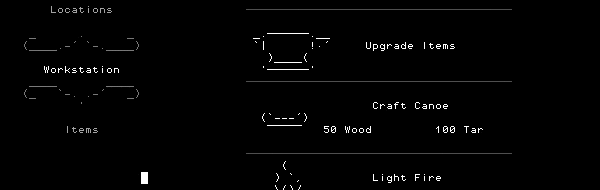

## Stone Story RPG

Stone Story RPG Free Download PC Game Cracked in Direct Link and Torrent. Stone Story RPG – In a realm of perpetual evil, a single stone could change everything. Stone Story is an RPG set in a dark and ominous world, animated entirely in ASCII symbols….

### Game Overview

> In a realm of perpetual evil, a single stone could change everything…
>
> Stone Story is an RPG set in a dark and ominous world. Monsters and mysteries plague the realm. Embark on a quest to unite 9 magic Soul Stones and restore the light.

The game takes elements from various genres and repackages them into a wholly unique experience. One of Stone Story’s defining mechanics is that you have no direct control of the player character, as an A.I. does all the exploring, combat and looting. That doesn’t mean this is an idle game. Potions and special abilities are maximized by good timing. Boss fights are intense, requiring quick item swaps if the boss changes patterns.

Your natural curiosity will be your greatest tool as you delve into the game and discover there’s more beneath its deceptively simple surface.

### FEATURES

Key Fetures:
+ Stunning ASCII animation and gorgeous music
+ Robust player A.I. that combines with other game systems to offer a unique experience for gamers of all types
+ 8 unique Locations, each with their own meticulously detailed environments and intense boss fights
+ Simple, but deep crafting system
+ Dozens of items that can be combined to facilitate new strategies
+ A rich fantasy world with eccentric enemies, amusing NPC encounters and engaging lore
+ 8+ hours of main story gameplay, in addition to procedurally generated content
+ Plenty of secrets!

### Story

Set in a dark and ominous world, where monsters and mysteries plague the realm. Embark on a quest to unite 9 magic Soul Stones and restore the light.

The game takes elements from various genres and repackages them into a wholly unique experience. One of Stone Story's defining mechanics is that you have no direct control of the player character, as an A.I. does all the exploring, combat and looting. Though this is an auto-RPG, that doesn't mean it's an idle game. Potions and special abilities are maximized by good timing. Boss fights are intense, requiring quick item swaps if the boss changes patterns.

Your natural curiosity will be your greatest tool as you delve into the game and discover there's more beneath its deceptively simple surface.

